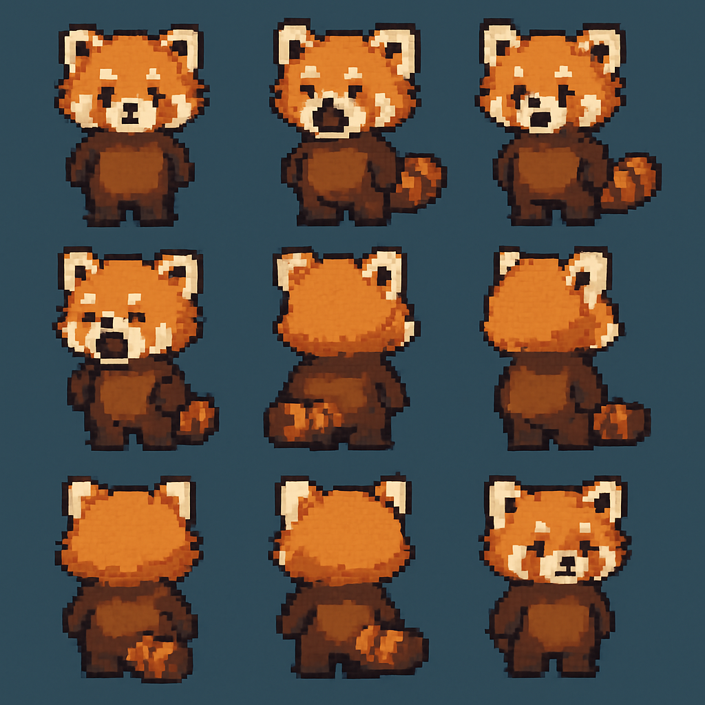

# Sprite Sheet to GIF Converter

A free web tool that converts sprite sheets into animated GIFs. Useful for video game developers and animators.

**Use it here: [https://collidingscopes.github.io/spritesheet-to-gif](https://collidingscopes.github.io/spritesheet-to-gif)**

 
 

## Features

- Upload any sprite sheet image
- Configure rows and columns to extract frames
- Adjust animation speed
- Download generated GIF

## Technologies

- Pure HTML, CSS, and JavaScript
- Uses [gif.js](https://github.com/jnordberg/gif.js) by Johan Nordberg for GIF generation
- No server-side processing required

## Setup

**Use it here: [https://collidingscopes.github.io/spritesheet-to-gif](https://collidingscopes.github.io/spritesheet-to-gif)**

If you want to run this locally, simply clone the repository and open `index.html` in a browser:

```bash
git clone git@github.com:collidingScopes/spritesheet-to-gif.git
cd spritesheet-to-gif
```

## License

MIT

## Donations

If you found this tool useful, feel free to buy me a coffee. My name is Alan and my passion is to build open source projects for animation, web games, and other pursuits.

This would be much appreciated during late-night coding sessions

<a href="https://www.buymeacoffee.com/stereodrift" target="_blank"></a>